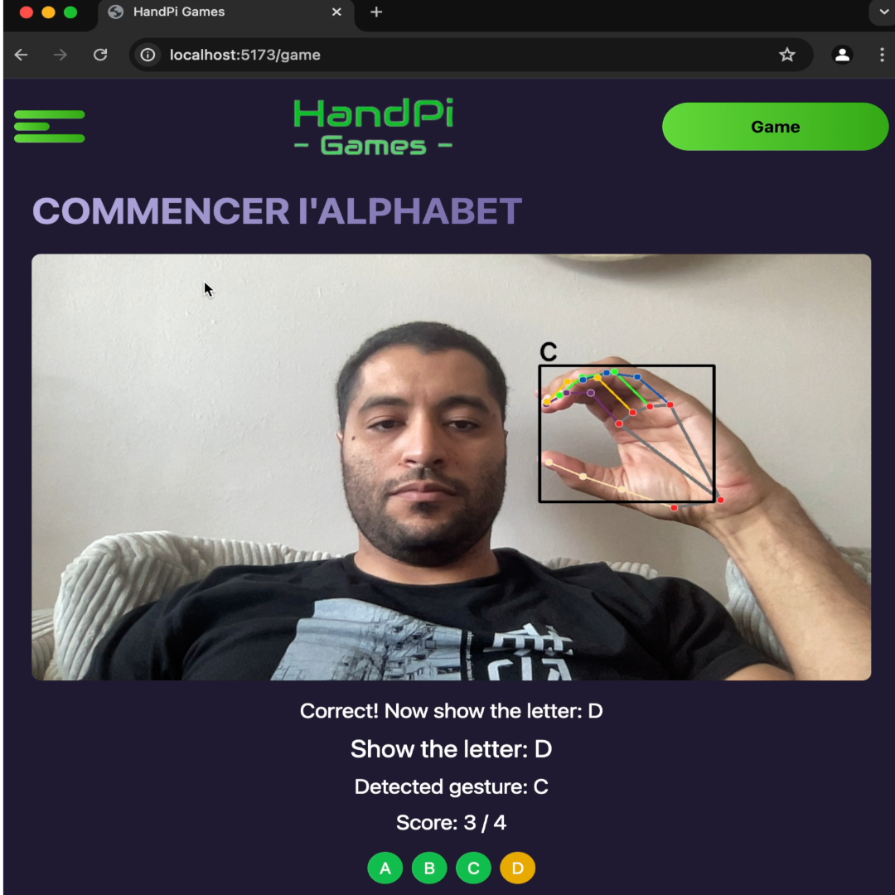

# HandPi Games - AI Hand Gesture Recognition Demo

A modern AI-powered hand gesture recognition web application showcasing real-time computer vision and interactive gaming. Originally developed for the "Open Project IoT" hackathon, now evolved into a full-stack web demo for portfolio demonstration.



## Project Overview

HandPi Games demonstrates AI/ML capabilities through an interactive web application that recognizes hand gestures in real-time to control educational games. This project showcases modern web development practices, containerized deployment, and real-time computer vision processing.

### Features

- **Real-time Hand Gesture Recognition**: OpenCV + MediaPipe for instant detection
- **Interactive ABCD Game**: Players show hand gestures for letters A, B, C, and D
- **Modern Web UI**: Responsive React frontend with Tailwind CSS
- **Real-time Video Processing**: Live camera feed with AI overlay
- **Score Tracking**: Complete game progression system

## Tech Stack

- **Frontend**: React 18, Vite 4, Tailwind CSS 3, Framer Motion 10
- **Backend**: Flask 2.3, OpenCV 4.8, MediaPipe 0.10, scikit-learn 1.5
- **Infrastructure**: Docker, Kubernetes, Nginx, GitHub Actions
- **Deployment**: VPS with K3s, Traefik, ArgoCD GitOps

## Live Demo

🚀 **[View Live Demo](https://handpigames.com)**

## Quick Start

### Prerequisites

- Docker and Docker Compose
- Camera/Webcam

### Running Locally

```bash
git clone https://github.com/Amirofcodes/HandPi-Games.git
cd HandPi-Games
cp compose/.env.example compose/.env
cd compose && docker-compose up -d
```

**Access URLs:**

- **Main app**: http://localhost (full experience)
- **Frontend dev**: http://localhost:3000 (development server)
- **Backend API**: http://localhost/api (REST endpoints)

### Alternative Setup (Manual)

<details>
<summary>Click to expand manual setup instructions</summary>

**Backend:**

```bash
cd backend
python -m venv venv
source venv/bin/activate  # Windows: venv\Scripts\activate
pip install -r requirements.txt
python run.py
```

**Frontend:**

```bash
cd frontend
npm install
npm run dev
```

</details>

## How to Play

1. **Access the Application** → Visit the live demo or run locally
2. **Allow Camera Access** → Grant browser permission for webcam
3. **Start the Game** → Click "Start Game" for the ABCD challenge
4. **Show Gestures** → Display hand gestures for letters A, B, C, D
5. **Real-time Recognition** → Watch AI recognize your gestures instantly
6. **Complete Challenge** → Progress through all letters to finish

## Architecture

**Microservices Design:**

- **Router (Nginx)**: Routes `/` to frontend, `/api/*` to backend
- **Backend (Flask)**: API server with AI/ML processing
- **Frontend (React)**: Modern web UI with real-time updates

**Deployment:**

- **Development**: Docker Compose for local development
- **Production**: Kubernetes on VPS with GitOps deployment

For detailed architecture, see [ARCHITECTURE.md](ARCHITECTURE.md).

## AI/ML Implementation

- **OpenCV**: Real-time video capture and image processing
- **MediaPipe**: Hand landmark detection and tracking
- **scikit-learn**: Machine learning model for gesture classification
- **Real-time Inference**: Sub-100ms gesture recognition

## Development

**Making Changes:**

- **Backend**: Edit `backend/` files → Flask auto-restarts
- **Frontend**: Edit `frontend/` files → Vite provides HMR
- **Config**: Update `config/` and restart containers

**Useful Commands:**

```bash
cd compose
docker-compose logs -f              # View logs
docker-compose restart frontend     # Restart service
docker-compose down -v && docker-compose up -d  # Clean restart
```

## Portfolio Highlights

**Technical Skills:**

- ✅ Real-time AI/ML with sub-100ms recognition
- ✅ Modern React 18 + Vite development
- ✅ Flask RESTful API design
- ✅ Docker containerization
- ✅ Kubernetes deployment
- ✅ CI/CD with GitHub Actions
- ✅ GitOps with ArgoCD

**Architecture:**

- Microservices with container orchestration
- Production VPS deployment
- Automated CI/CD pipeline
- Health monitoring and scaling

## Troubleshooting

- **Camera Issues**: Ensure browser permissions and HTTPS for production
- **Container Issues**: Check `docker-compose logs <service-name>`
- **Port Conflicts**: Verify `.env` port configurations

## Project Evolution

**Originally**: IoT hackathon project for Raspberry Pi  
**Now**: Modern web application showcasing AI/ML capabilities for portfolio demonstration

---

_This project demonstrates modern full-stack development with AI/ML integration, showcasing skills in web development, computer vision, and cloud deployment._
